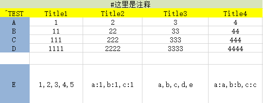
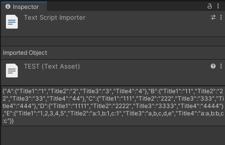
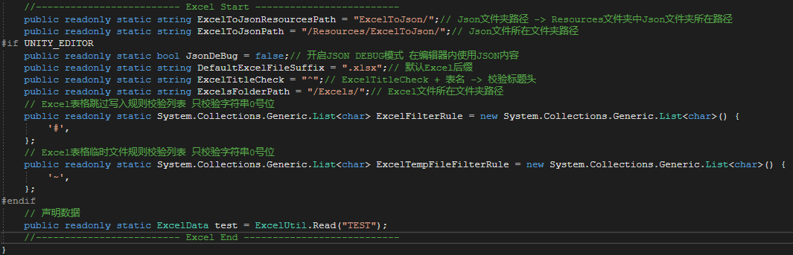

# Unity_ExcelUtil
Used to easily read excel data bing in the editor and use json to read after compilation!

用于在编辑器内便捷读取excel数据bing且在编译后使用json读取！

Unity 版本 2020.3.12f1c1

需要两个插件（这个工程已经集成了，不用再下载了）
1. litjson 仓库地址 https://github.com/LitJSON/litjson
2. ExcelDataReader 仓库地址 https://github.com/ExcelDataReader/ExcelDataReader

在游戏数据内容的日益增大，数据存放和整理越来越难了。大部分游戏公司选择把游戏数据存在excel或者数据库中。对于写死的数据我们通常存在excel中或者json中更好。

但是由于excel部分原因，编译后excel会出现各种问题。例如需要I18N或者手机上无法读取到等。

因为这些原因所以我写了个ExcelUtil.cs，它能帮助你在编辑器中使用excel编辑数据，当你觉得数据已经处理完成的时候。使用菜单栏上的 BuildTools -> ExcelToJson 快速将excel数据直接转成json数据。

Excel 数据格式（^开头代表本行标题头，后面跟着文件名。#开头代表本行注释。更多选择可以在DataManager.cs中修改）：

Excel转换成Json的数据文件

如果你需要把代码迁移到你的工程中，仅需迁移ExcelUtil.cs、DataManager.cs、MenuTool.cs这三个文件。也可以将DataManager.cs的代码合并在ExcelUtil.cs中，并在你的其他脚本中声明ExcelData变量！

然后请注意修改DataManager.cs的变量（文件储存路径和格式校验等）：

这时候当你编译打包后，代码读取的数据会由excel变成json储存在Resources文件夹。然后通过Resources.Load<TextAsset>() 来读取。（注意，更新excel数据后需要打包请再更新成json数据，只有点击按钮才会进行更新！）

如果需要在编辑器内使用json数据进行调试，请打开 DataManager.cs 脚本修改 JsonDeBug 值为 True 即可！

示例请看脚本 TEST.cs，详细内容请看代码，就不一一展示了！需要扩展请看 DataManager.cs 最下面的 ExcelData类 里面存放着对文本的各种解析！

有问题请发Issue哦！
